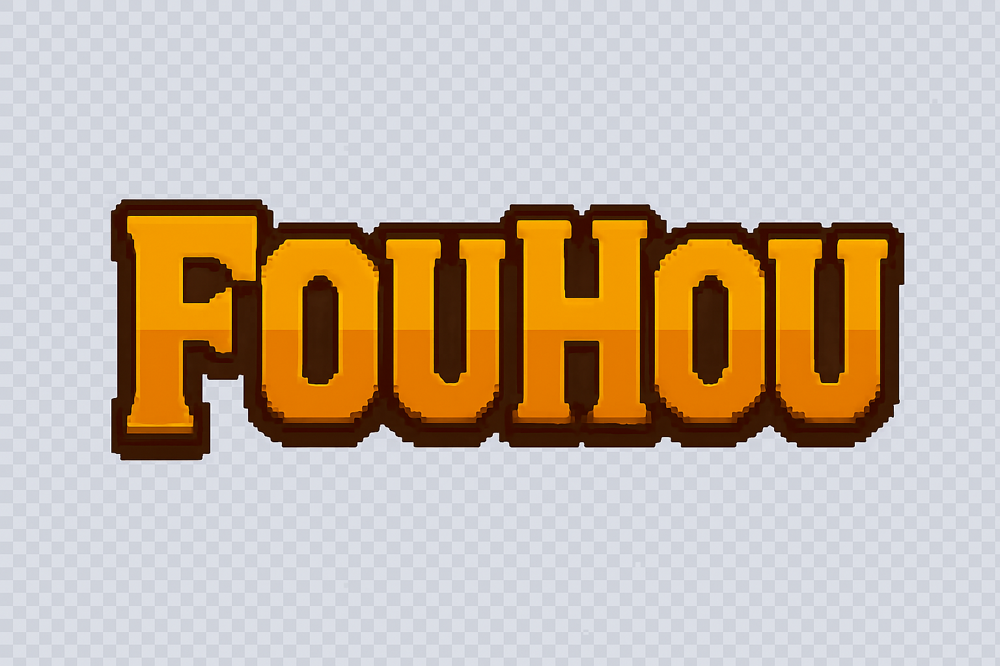

# 🎮 Fouhou

<div align="center">



**A bullet hell game inspired by the Touhou series**

*University Project - Game Development*

[](https://unity3d.com/)
[](https://docs.microsoft.com/en-us/dotnet/csharp/)
[](https://github.com/StoyanovDenislav/Fouhou)

</div>

## 🌟 About

Fouhou is a bullet hell game heavily inspired by the legendary Touhou series. Navigate through intricate bullet patterns, survive challenging stages, and test your reflexes in this fast-paced action game. Built as a university project to explore game development concepts and Unity engine capabilities.

## ✨ Features

### 🎯 Core Gameplay
- **Bullet Hell Action**: Navigate through complex bullet patterns and obstacles
- **Multiple Stages**: Progress through different stages with unique challenges
- **Dynamic Scoring System**: Real-time score tracking with survival bonuses
- **Health & Shield System**: Player health management with temporary shield mechanics

### 🎮 Game Mechanics
- **Pattern-Based Enemy AI**: Sophisticated bullet patterns using scriptable objects
- **Stage Progression**: Sequential stage system with group-based pattern spawning
- **Dialogue System**: Story elements with character dialogue sequences
- **Score Submission**: Online leaderboard integration with ranking system

### 🔧 Technical Features
- **Object Pooling**: Optimized bullet management for performance
- **Modular Pattern System**: Easily extensible bullet pattern creation
- **Real-time Analytics**: Score tracking and gameplay metrics
- **Cross-platform Ready**: Built with Unity's Universal Render Pipeline

## 🚀 Getting Started

### Prerequisites
- Unity 6000.2.2f1 or later
- .NET Framework 4.7.1 or later
- Windows/Mac/Linux compatible system

### Installation

1. **Clone the repository**
   ```bash
   git clone https://github.com/StoyanovDenislav/Fouhou.git
   cd Fouhou
   ```

2. **Open in Unity**
   - Launch Unity Hub
   - Click "Open" and select the cloned folder
   - Unity will automatically import the project

3. **Play the Game**
   - Open the `Test BulletHell` scene in `Assets/Scenes/`
   - Press the Play button in Unity Editor

## 🎮 How to Play

### Controls
- **Movement**: Arrow Keys or WASD
- **Focus Mode**: Hold Shift for precise movement
- **Pause**: Esc key

### Objective
- Survive as long as possible while avoiding bullet patterns
- Each second survived earns points
- Completing patterns and stages provides bonus points
- Try to achieve the highest score possible!

## 🏗️ Project Structure

```
Assets/
├── Scenes/          # Game scenes
├── scripts/         # Core game logic
│   ├── dialogue/    # Dialogue system
│   ├── mechanics/   # Health and core mechanics
│   ├── obstacles/   # Bullet patterns and spawning
│   ├── player/      # Player movement and input
│   └── score/       # Scoring and leaderboard system
├── prefabs/         # Game object prefabs
├── assets/          # Art, music, and UI resources
└── Settings/        # Unity project settings
```

## 🎨 Key Systems

### Bullet Pattern System
The game uses a flexible pattern system built with ScriptableObjects:
- **ObstaclePattern**: Base class for all bullet patterns
- **FlowerPattern**: Example implementation of circular bullet spreads
- **StageSequence**: Manages pattern groups and stage progression
- **BulletPool**: Optimized object pooling for performance

### Scoring System
- Real-time score calculation based on survival time
- Pattern completion bonuses
- Stage progression rewards
- Online leaderboard integration via REST API

### Health System
- Player health management with visual feedback
- Temporary shield system upon taking damage
- Collision detection with optimized physics

## 🔧 Development

### Adding New Bullet Patterns
1. Create a new script inheriting from `ObstaclePattern`
2. Implement the `Fire()` method with your pattern logic
3. Create a ScriptableObject asset in the editor
4. Add to stage sequences for gameplay integration

### Extending the Dialogue System
- Use `DialogueSequence` ScriptableObjects
- Configure in `DialogueManager` for automatic playback
- Integrate with stage progression system

## 🌐 Online Features

The game includes online leaderboard functionality:
- Score submission to remote API
- Player ranking system
- Persistent high score tracking
- Cross-session score comparison

API endpoint: `https://api.fouhou.stoyanography.com/api`

## 📝 Contributing

This is a university project, but feedback and suggestions are welcome! Feel free to:
- Report bugs or issues
- Suggest gameplay improvements
- Share your high scores
- Provide feedback on game balance

## 🙏 Acknowledgments

- **Team Shangai Alice** - For creating the incredible Touhou series that inspired this project
- **Unity Technologies** - For the amazing game engine
- **University Community** - For support and feedback during development

## 📄 License

This project is for educational purposes. All original Touhou-related concepts and inspiration belong to their respective creators.

---

<div align="center">

**🎮 Ready to test your reflexes? Download and play Fouhou today! 🎮**

*Made with ❤️ using Unity*

</div>
